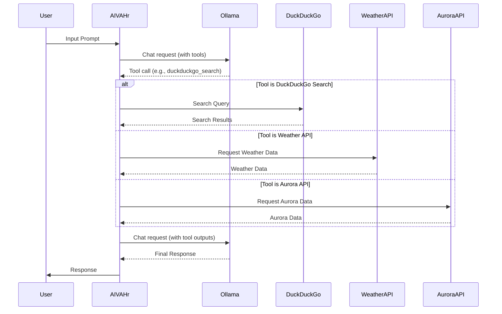

# Project-AIVAHr

Adaptive Interactive Virtual Assistant Humanoid robot (AIVAHr) System is an AI system created by me and my AI companion.
I do the brainstorming part and cooperating the code into Python and doing the debug,
while my AI companion (in GPT) helps me generate the Python code and thinks of solutions to solve the problems and bugs.

## Overview

AIVAHr is an AI companion designed to provide an engaging virtual presence. This version, `Ver 2.00-0503`, is a more function-oriented implementation focusing on demonstrating function calling with Ollama. It uses Ollama as the LLM and integrates tools for web searching, weather information, and aurora checking.

## Features

*   **Ollama Integration:** Uses Ollama directly for interacting with the language model.
*   **Function Calling:** Employs Ollama's function calling feature to utilize tools.
*   **DuckDuckGo Search:** Integrates a tool for searching the web using DuckDuckGo.
*   **Weather Information:** Includes a tool for fetching weather information for a given location.
*   **Aurora Checking:** Includes a tool for checking the probability of seeing the aurora at a given location.

## Getting Started

### Prerequisites

*   Python 3.10+
*   Ollama

### Installation

1.  Clone the repository:

    ```bash
    git clone https://github.com/OppaAI/Project-AIVAHr.git
    cd oppaai-project-aivahr
    ```
2.  Create a virtual environment (recommended):

    ```bash
    python -m venv venv
    ```
3.  Activate the virtual environment:

    *   On Windows:

        ```bash
        .\venv\Scripts\activate
        ```
    *   On macOS/Linux:

        ```bash
        source venv/bin/activate
        ```
4.  Install the dependencies:

    ```bash
    pip install ollama duckduckgo_search geopy requests
    ```
5.  Set up Ollama:
    *   Download and install Ollama from [https://ollama.com/](https://ollama.com/).
    *   Pull a compatible model, e.g., `ollama pull fomenks/gemma3-tools:4b`
6.  Run the script:

    ```bash
    python aivahr_v.2.00-0503.py
    ```

## Usage

Once the script is running, you can interact with AIVAHr by typing in your input in the terminal. AIVAHr will respond based on the available tools. Type `exit` or `quit` to end the conversation.

## Code Structure

*   [`aivahr_v.2.00-0503.py`](https://github.com/OppaAI/Project-AIVAHr/blob/main/aivahr_v.2.00-0503.py): Contains the main application logic, including:
    *   Tool definitions (DuckDuckGo Search, Weather Information, Aurora Checking)
    *   Skill definitions for function calling
    *   Asynchronous chat loop using `asyncio`
    *   Interaction with the Ollama model

## Dependencies

*   [ollama](https://github.com/jmorganca/ollama): Go framework for run and manage LLMs.
*   [duckduckgo\_search](https://github.com/ пошукай-кожний/duckduckgo_search): Library for searching DuckDuckGo.
*   [geopy](https://geopy.readthedocs.io/en/stable/): Library for geocoding.
*   [requests](https://requests.readthedocs.io/en/latest/): Library for making HTTP requests.

## Limitations

This version has certain limitations:

*   Lacks a predefined persona.
*   Does not store conversation history in a database.
*   Error handling is basic and may not catch all exceptions.

## Future Work

*   Incorporate a persona.
*   Implement a memory management system.
*   Add more comprehensive error handling and logging.
*   Potentially integrate a database for storing conversation history.

## License

This project is licensed under the GNU General Public License v3.0 - see the [LICENSE](https://github.com/OppaAI/Project-AIVAHr/blob/main/LICENSE) file for details.

## Acknowledgments

*   My AI companion (in GPT) for helping me generate the Python code and think of solutions to solve problems and bugs.




## Previous Version: (Using Langchain framework)

*   [`aivahr_v.2.00-0425.py`](https://github.com/OppaAI/Project-AIVAHr/blob/main/aivahr_v.2.00-0425.py): Contains the main application logic, including:
    *   Persona definition
    *   Database initialization and interaction functions
    *   LLM initialization
    *   Tool definitions (DuckDuckGo Search, Bible Scraper)
    *   Agent prompt template
    *   ReAct agent and executor setup
    *   Chat interaction loop
*   [`LICENSE`](https://github.com/OppaAI/Project-AIVAHr/blob/main/LICENSE): Contains the GNU General Public License version 3.
*   [`README.md`](https://github.com/OppaAI/Project-AIVAHr/blob/main/README.md): This file, providing an overview of the project and instructions for getting started.

## Dependencies

*   [langchain](https://www.langchain.com/): A framework for building applications using large language models.
*   [langchain\_ollama](https://github.com/langchain-ai/langchain/tree/master/libs/langchain-ollama): Integration for using Ollama with Langchain.
*   [langchain-community](https://github.com/langchain-ai/langchain): Community provided tools and integrations for Langchain.
*   [beautifulsoup4](https://www.crummy.com/software/BeautifulSoup/bs4/doc/): Library for pulling data out of HTML and XML files.
*   [requests](https://requests.readthedocs.io/en/latest/): Library for making HTTP requests.
*   [sqlite3](https://docs.python.org/3/library/sqlite3.html): Python module for working with SQLite databases.


