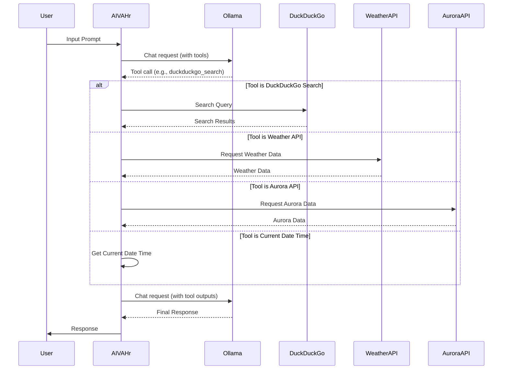

# Project: Amazing GRACE iteration

Amazing GRACE iteration is a project to create an AI system created by me and my AI companion,
that can run in lower computing resource environment but able to improve living standards of humanity.
I do the brainstorming part and incooperating the codes generated by my AI companion into Python and doing the debug,
while my AI companion helps me generate the Python code and thinks of solutions to solve the problems and bugs.

The name GRACE comes from Generative, Reasoning, Adaptive Cognitive Engine, which are the 3 LLMs running the core of this AI system.

## Overview

GRACE is an AI companion designed to provide an engaging virtual presence. This version, `Ver 2.01-0503`, is a function-oriented implementation demonstrating function calling with Ollama. It uses Ollama as the LLM and integrates tools for web searching, weather information, and aurora checking.

## Features

*   **Ollama Integration:** Uses Ollama directly for interacting with the language model.
*   **Function Calling:** Employs Ollama's function calling feature to utilize tools.
*   **DuckDuckGo Search:** Integrates a tool for searching the web using DuckDuckGo.
*   **Weather Information:** Includes a tool for fetching weather information for a given location.
*   **Aurora Checking:** Includes a tool for checking the probability of seeing the aurora at a given location.
*   **Current Date and Time:** Includes a tool for fetching the current date and time.

## Getting Started

### Prerequisites

*   Python 3.10+
*   Ollama

### Installation

1.  Clone the repository:

    ```bash
    git clone [https://github.com/OppaAI/AGi.git]
    cd AGi
    ```
2.  Create a virtual environment (recommended):

    ```bash
    python -m venv venv
    ```
3.  Activate the virtual environment:

    *   On Windows:

        ```bash
        .\venv\Scripts\activate
        ```
    *   On macOS/Linux:

        ```bash
        source venv/bin/activate
        ```
4.  Install the dependencies:

    ```bash
    pip install ollama duckduckgo_search geopy requests
    ```
5.  Set up Ollama:
    *   Download and install Ollama from [https://ollama.com/](https://ollama.com/).
    *   Pull a compatible model, e.g., `ollama pull fomenks/gemma3-tools:4b`
6.  Run the script:

    ```bash
    python grace_v.2.01-0503.py
    ```

## Usage

Once the script is running, you can interact with AIVAHr by typing in your input in the terminal. AIVAHr will respond based on the available tools. Type `exit` or `quit` to end the conversation.

## Code Structure

*   [`grace_v.2.01-0503.py`](https://github.com/OppaAI/Amazing.Grace.iteration/blob/main/grace_v.2.01-0503.py): Contains the main application logic, including:
    *   Tool definitions (DuckDuckGo Search, Weather Information, Aurora Checking, Current Date and Time)
    *   Skill definitions for function calling
    *   Asynchronous chat loop using `asyncio`
    *   Interaction with the Ollama model

## Dependencies

*   [ollama](https://github.com/jmorganca/ollama): Go framework for run and manage LLMs.
*   [duckduckgo_search](https://github.com/deedy5/duckduckgo_search): Library for searching DuckDuckGo.
*   [geopy](https://geopy.readthedocs.io/en/stable/): Library for geocoding.
*   [requests](https://requests.readthedocs.io/en/latest/): Library for making HTTP requests.

## Limitations

This version has certain limitations:

*   Lacks a predefined persona.
*   Does not store conversation history in a database.
*   Error handling is basic and may not catch all exceptions.

## Future Work

*   Incorporate a persona.
*   Implement a memory management system.
*   Add more comprehensive error handling and logging.
*   Potentially integrate a database for storing conversation history.

## License

This project is licensed under the GNU General Public License v3.0 - see the [LICENSE](https://github.com/OppaAI/Amazing.Grace.iteration/blob/main/LICENSE) file for details.

## Acknowledgments

*   My AI companion (in GPT) for helping me generate the Python code and think of solutions to solve problems and bugs.




